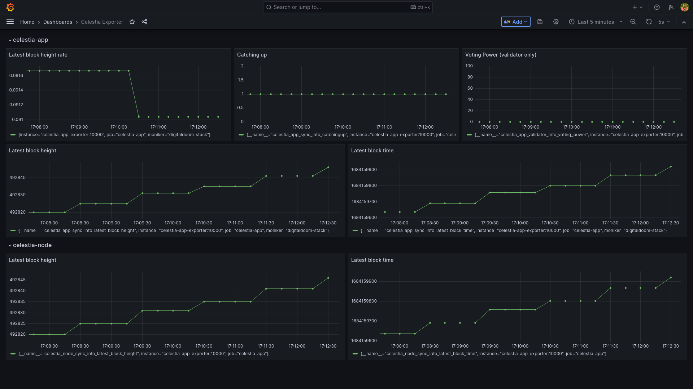

# celestia docker stack
This repo provides easy way to deploy and monitor celestia nodes (celestia-app and light node) using docker compose and prometheus stack. Information about node state gathered over local rpc queries via exporter and displayed in Grafana dashboard.
Additionally it installs node exporter, cadvisor and corresponding Grafana dashboards.
Written and tested on blockspacerace chain.

## Getting started:

```
git clone https://github.com/etretien/celestia-docker
cd celestia-docker
```

Next, depending on what node you want to run, start init script:
* for celestia-app: `MONIKER=<node name> ./init-celestia-app.sh`
* for celestia-node light: `./init-celestia-node.sh`
* or both

celestia-app is built from source (https://github.com/etretien/celestia-docker/blob/main/Dockerfile), while celestia-node is pulled from official celestiaorg registry.

By default exporter configured to scrape data for both celestia-app and celestia-node. If you dont deploy one of node type, you need to provide env variable for exporter. For example, if you only run celestia light node, run `echo CELESTIA_ENABLE=node > exporter.env`. And if you only run celestia-app, `echo CELESTIA_ENABLE=app > exporter.env`. Defaults is `CELESTIA_ENABLE=app,node`

Start monitoring services:
```
./init-monitoring.sh
```

Grafana should be accessible at http://localhost:3000 , default login `admin` and password `admin`

## Dashboard



## License

[MIT](https://choosealicense.com/licenses/mit/)

